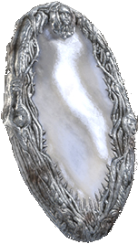

# Universal Souls Mirror Mod

Universal Souls Mirror Mod lets you experience many recent From Software titles on a mirrored map. 

##  [Latest Release](https://github.com/pawREP/MirrorMod/releases/latest)

##  [Installation Instructions](/docs/Installation.md)

## Compatibility:

| Game                  | Support                   | Notes                           |
| --------------------- | ------------------------- | ------------------------------- |
| Elden Ring            | :heavy_check_mark:        | Full support                    |
| Sekiro                | :heavy_check_mark:        | Full support                    |
| Dark Souls III        | :heavy_check_mark:        | Full support                    |
| Dark Souls II Sotfs   | :heavy_check_mark:        | Full support                    |
| Dark Souls II         | :x:                       | Currently unsupported           |
| Dark Souls Remastered | :heavy_check_mark:        | Full support                    | 
| Dark Souls Ptde       | :x:                       | Currently unsupported           | 
| Demon's Souls         | :x:                       | No current or planned support   | 
| Bloodborne            | :x:                       | No current or planned support   | 

## Build instructions:
 ### DINPUT8.dll / MirrorMod.dll:
 - The cmake project should build out of the box without any changes using the most recent versions of CMake and Visual Studio. Development uses CMake 3.22.0 and MSVC 17.4.2. The target game to build for can be selected with the `MIRROR_TARGET_GAME` option during configuration. 

 ### MirrorMod.json:
 - The json configuration file is generated by converting the shipped MirrorMod.yaml file to json. If you don't plan on editing the configuration it's easiest to copy the json file from a recent release. 

 ### Shaders:
 - Required shaders for each game are shipped in the form of binaries and HLSL source code. Sources can be build with the respective DirectX SDK tools. Depending on the game, shaders might also have to be packed into native game archives using [Yabber](https://github.com/JKAnderson/Yabber). The included binaries already come packed and in the folder structure expected.
